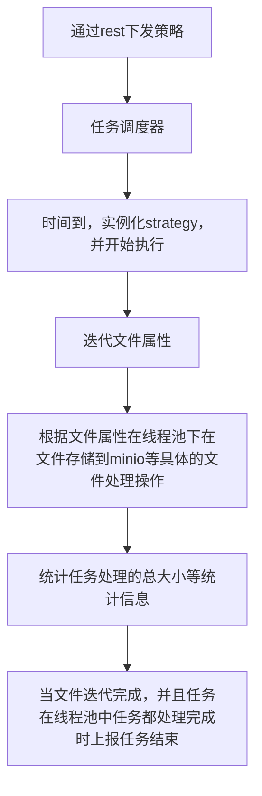
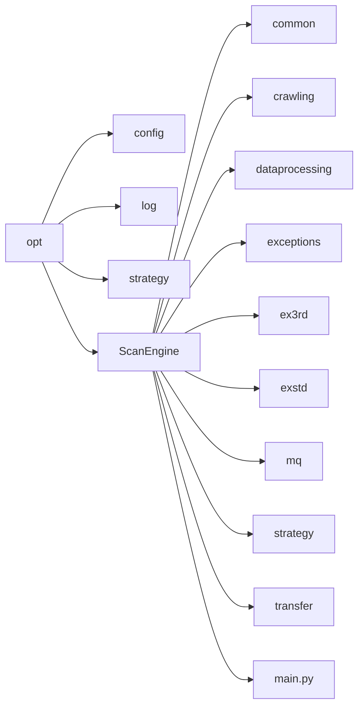

# ScanEngine设计
## 流程图如下


## 策略书说明
当前任务代码的模块和任务书对应，通过策略书可以知道目前的模块和功能，以文件共享协议为例子，做说明。
```json
{
    "scheduler": {
        "op": "start",
        "date_time": "2025-03-07T15:16:00",
        "on_inactive": {
            "minutes": 30
        }
    },
    "identity": "d888b9e768ae4e298ef9ca28cc5634b2",
    "cls": "strategy.Discovery",
    "strategy": {
        "iterator": {
            "auth": {
                "password": "Spinfo0123",
                "port": "445",
                "is_direct_tcp": true,
                "remote_name": "",
                "host": "192.190.10.110",
                "use_ntlm_v2": true,
                "username": "ank"
            },
            "resources": {
                "children": [
                    {
                        "path": "share",
                        "comments": "",
                        "children": [
                            {
                                "path": "share/0118",
                                "isReadOnly": false,
                                "create_time": 1647242453.9173565,
                                "children": [],
                                "last_attr_change_time": 1718759329.4673693,
                                "name": "0118",
                                "type": "file",
                                "last_access_time": 1741244551.2484307,
                                "last_write_time": 1647242455.0981991
                            },
                            {
                                "path": "share/1",
                                "isReadOnly": false,
                                "create_time": 1611827041.3821857,
                                "children": [],
                                "last_attr_change_time": 1733297175.2238288,
                                "name": "1",
                                "type": "file",
                                "last_access_time": 1741245076.6209393,
                                "last_write_time": 1655100757.49968
                            },
                            {
                                "path": "share/10M",
                                "isReadOnly": false,
                                "create_time": 1559795012.786942,
                                "children": [],
                                "last_attr_change_time": 1718759337.6136973,
                                "name": "10M",
                                "type": "file",
                                "last_access_time": 1741253855.2506583,
                                "last_write_time": 1568636508.4939816
                            }
                        ],
                        "isSpecial": false,
                        "name": "share",
                        "type": "file"
                    }
                ],
                "name": ""
            }
        },
        "action": {
            "method": "file",
            "url_enabled": "0",
            "cls": "dataprocessing.storage.MinioStorage",
            "url_distinguish_count": "",
            "url_distinguish_type": ""
        },
        "cls": "SMB",
        "speeds": [
            {
                "end": "18:00:00",
                "begin": "08:00:00",
                "speed": 2
            }
        ],
        "filters": {
            "size": {
                "le": 83886080
            },
            "name": {
                "include": [
                    ".pptx",
                    ".xlsx",
                    ".docx",
                    ".7z",
                    ".bz",
                    ".tbz",
                    ".bz2",
                    ".tbz2",
                    ".doc",
                    ".tgz",
                    ".gz",
                    ".rar",
                    ".tar",
                    ".zip",
                    ".pdf",
                    ".jpg",
                    ".png",
                    ".tiff",
                    ".tif",
                    ".dwg",
                    ".html",
                    ".htm",
                    ".txt",
                    ".xls",
                    ".ofd",
                    ".ceb",
                    ".ppt"
                ]
            },
            "timestamp": {
                "le": 1741363220.0,
                "ge": 1738909227
            }
        },
        "rules_id": "b4d511a8e565357c96361323eccfe879"
    }
}

```

### scheduler
此模块为任务调度的描述，功能为策略何时运行，示例中的任务调度为任务从2025-03-07T15:16:00开始，在运行完成后的30分钟后继续运行。  
1. op
这个参数是任务执行的方法，目前只有一个start
2. date_time
这个参数表明任务何时开始运行，当不设置时，任务立即运行
3. onetime
这个模块是可选的，共包含onetime， on_active，on_inactive三种情况，内部支持年月日，时分秒，表示时间段。
当不配置时默认为onetime，表示任务只运行一次
on_inactive 表示se任务完成后的多场时间再次运行
on_active 表示任务从开始的时间算多场时间再次运行


### identity
这个参数是策略的id

### cls
这个是策略的执行类，对应不同的任务执行流程，目前只关注strategy.Discovery，这是一个标准的etl流程，当此流程不适合的任务扩展其他流程。  
当然策略执行类依然是组建模块化的。

### strategy
这里是策略执行类的参数资源描述
#### cls
在strategy内部的cls，对应的是不同的存储协议对应的类，通常以具体的协议名称来命名，比如本示例中的windows文件共享对应的协议smba简写为SMB
#### iterator
这是迭代器的资源描述，我们抽取数据是按照生成式的迭代方法，包含两个模块auth，和 resources。
##### auth
这里面是我们连接服务器时的连接信息，每一种存储都不一样，包括ip, 端口，用户名，密码等信息，这个是根据具体要连的协议配置。
如对象存储需要的就是endpoint 密钥对，数据库连接需要的就是jdbcurl，等
##### resources
这是要扫描的资源信息描述，在文件系统的存储来说，他通常是目录和文件名，
任务书中的所有属性都是在服务器对应的文件或资源的attr, 我们不做任何修改，拿到哪些信息，就用哪些信息。
但需要关注以下特殊的属性：
1. type
用来标识资源的类型，目前共有3种，file/binary/string
- file  
文件处理，将文件存放到minio，将文件属性，存放在minio的路径uri和job_id，task_id, rules_id, 以及pe需要的在action中定义的参数合并发到kafka data_p_file队列中
- binary
和file类型的处理方式基本相同，数据库中的blob等类型的二进制，我们任务他是一个文件，携带了它所在表的主键列信息和主键列的值，还有二进制列的信息
- string  
这是数据库中非二进制blob列的数据标识，都是字符串不需要过文件解析，默认每1000条（可配）处理一次，提高处理效率。将这1000条数据序列化为json，存到minio，并将相应的属性发送到kafka data_p_meta中


以上的所有消息示例参照代码库doc中的json示例

2. children
这是我们统一抽象出来的属性，代表可以展开的资源，文件系统的目录是一个树形结构，我们的json也是一个属性的结构。
当资源到达具体的文件如/opt/1.txt，就不再包含children属性
#### speeds
这个是带宽设置的描述
1. begin
开始时间
2. end
结束时间
3. speed
下载速度以MB/s为单位i

#### filters
是过滤器的描述，可选配置，可以按照文件资源的属性，决定是否跳过不处理文件。
包含size（大小限制），name (主要按照后缀名称过滤文件类型)， timestamp（根据时间戳来决定是否过滤文件）
处理的判断条件有以下几种
1. lt
代表小于，如size下，"lt": 83886080，表示文件需小于80M文件才会处理，如果大于80M过滤掉。
2. le
小于等于，同上
3. eq
等于，比如在对象存储中, 将storage_class 设置为standard，就会跳过归档achieve数据
"storage_class": {
    "eq": "standard"
}
4. ne
不等于
5. gt
大于
6. ge
大于等于
7. include
包含，用于文件名称属性的后缀，如下的示例表示处理pptx和xlsx文件，其余文件不处理
"name": {
    "include": [
        ".pptx",
        ".xlsx"
        ]
}
8. exclude
包含，和include相反用于文件名称属性的后缀，如下的示例表示不处理pptx和xlsx文件，其余均处理

#### rules_id
这个是规则的id，数据由pe处理根据相应的规则生成的id，在se中有两个作用  
分别是用于pe模块处理数据时的标识，和用于生成增量扫描的hash

#### action
用于数据下载完成后的处理的参数描述

##### cls
dataprocessing.storage.MinioStorage
为数据的处理类，对于我们当前的扫描任务而言是存储到minio，并向相应的队列下发kafka消息。
后续可能会增加其他的处理保留了这个扩展接口，目前只有这么一个
其余的参数均为pe组建开启某些功能的开关，se这里不处理，也不需要，只需随kafka透传下发下去


## 代码目录说明


1. /opt  
为se在容器中的安装路径

2. log  
为se的log路径

3. /opt/strategy  
存放下发的策略json

4. ScanEngine  
我们的代码路径

5. '\_\_main__.py'  
这个是我们的程序入口，启动flask服务，实现和绑定rest api

6. common  
是我们的工具类，包含调度器，连接池装饰器工具，函数处理工具，配置文件的加载和全局资源

7. crawling  
对应策略书中的iterator模块和子模款，这里面是各种协议的连接，和迭代器的实现，和协议数据抽取相关的必要的工具类

8. dataprocessing
对应策略书中的action模块
对于下载完成数据的处理代码，目前只有存到minio 并发送消息给kafka这一种方式

9. exceptions
这个是自定义的异常类

10. exstd  
自定义的python标准库扩展，通常为了满足业务需求继承了python标准库的类，扩展其功能，
使用方法和python标准库一样，通常不改变接口

11. ex3rd
自定义的三方库扩展，同上，基本用于某些低质量三方库的bug修改，也不改接口，当社区修复时相应的代码可以删掉

12. mq
目前只有kafka一个类型，所有的消息队列的连接和接口封装，都在此处写

13. transfer
minio 的作用目前用于在各组建传输数据，如果以后用hdfs或者本地磁盘等其他的传输，在此扩展、

14. strategy
这是整个策略的流程实现，包含迭代文件，使用线程池下载文件并存放到minio，根据回调函数统计任务处理数量。


